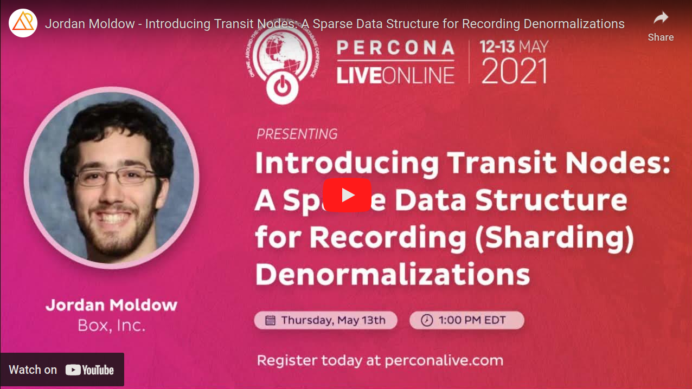
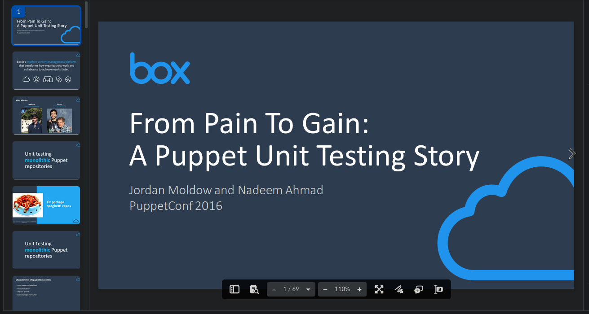

# Jordan Moldow's conference talks
Talks I've presented at conferences, meetups, etc.

##### Table of Contents

- [Talks](#talks)
  * [The Last Mile - Delivering the Last 10 Percent of a 4-year Migration](#the-last-mile---delivering-the-last-10-percent-of-a-4-year-migration)
  * [Deploying a Sharded Vitess Sandbox Cluster in Public Cloud Kubernetes in 10 Minutes](#deploying-a-sharded-vitess-sandbox-cluster-in-public-cloud-kubernetes-in-10-minutes)
  * [Introducing Transit Nodes - A Sparse Data Structure for Recording Sharding Denormalizations](#introducing-transit-nodes---a-sparse-data-structure-for-recording-sharding-denormalizations)
  * [Turning Pain Into Gain - A Puppet Unit Testing Story](#turning-pain-into-gain---a-puppet-unit-testing-story)
- [Conferences](#conferences)
  * [DeveloperWeek Global: Enterprise - December 2021](#developerweek-global-enterprise---december-2021)
  * [Percona Live Online - May 2021](#percona-live-online---may-2021)
  * [PuppetConf - October 2016](#puppetconf---october-2016)
- [Miscellaneous](#miscellaneous)
  * [Python 3 Async Tutorial](#python-3-async-tutorial)
  * [Intro Programming in Python](#intro-programming-in-python)

<small><i><a href='http://ecotrust-canada.github.io/markdown-toc/'>Table of contents generated with markdown-toc</a></i></small>

## Talks

### The Last Mile - Delivering the Last 10 Percent of a 4-year Migration
**And experiments in team effectiveness**

Presented by: **Jordan Moldow**

Presented at
- [DeveloperWeek Global: Enterprise - December 2021](#developerweek-global-enterprise---december-2021)
  * [[Description]](https://web.archive.org/web/20220810081639/https://embed.emamo.com/event/developerweek-global-enterprise-2021/s/the-last-mile-delivering-the-last-10-of-a-4-year-migration-WK4zqo "The Last Mile: Delivering the Last 10% Of a 4-Year Migration")
    [[Slides]](https://app.box.com/s/nntx8biljij0ts1zoczw31pjzre2sd0e "Slides")
- [Percona Live Online - May 2021](#percona-live-online---may-2021)
  * [[Recording]](https://www.youtube.com/watch?v=mYXy5q8rR1Y "Recording")
  * [[Description]](https://web.archive.org/web/20210508001407/https://perconaliveonline.sched.com/event/io6f/the-last-mile-delivering-the-last-10-of-a-four-year-migration "The Last Mile - Delivering the Last 10% of a 4-year Migration")
    [[Slides]](https://app.box.com/s/453j26vrbjbqpffr4spd27prfeq3y2m7 "Slides")

In complex projects, the last 10% of the project is often the most difficult part. In this talk, I will share a case study of Box's 4-year effort to get rid of our legacy mapping DB and move the last piece of our legacy monolith MySQL traffic to our data access layer. This talk will cover how to manage technical risk and optimize team execution in a technically complex and operationally distributed environment. This talk will share reflections on useful tactics that led to the successful completion of this four-year migration project for others to learn from and leverage.

As a relatively new Staff engineer, I learned and experimented with building and maintaining a long time-horizon project plan, identifying unknown unknowns, and continually finding ways to de-risk the project at every stage of development.

As the project progressed, I found that successful execution depended not only on these technical strategies, but even more so on how the team operated. In the spirit of Agile and mitigating the isolation of the pandemic, we experimented with almost every aspect of how we worked: how/when we worked together, how our sprints ran, how we evolved designs, and even the minutia of how we retrospected.

In this session, we will have a candid discussion on the technical and organizational strategies that I believe were important to our success, or that were promising enough to warrant more experimentation in the future.

Participants will leave with a few ideas that they should be able to try out within their own teams. Additionally, there are some deeper ideas about team leadership and effectiveness that I hope participants will be able to reflect on going forwards.

### Deploying a Sharded Vitess Sandbox Cluster in Public Cloud Kubernetes in 10 Minutes

Presented by: **Jordan Moldow**

Presented at: [Percona Live Online - May 2021](#percona-live-online---may-2021)

[[Recording]](https://www.youtube.com/watch?v=Bllc-u_cCGA "Recording")

[[Description]](https://web.archive.org/web/20210508001359/https://perconaliveonline.sched.com/event/io6K/deploying-a-sharded-vitess-sandbox-cluster-in-public-cloud-kubernetes-in-10-minutes "Deploying a Sharded Vitess Sandbox Cluster in Public Cloud Kubernetes in 10 Minutes")
[[Slides]](https://app.box.com/s/p3e03oqiwv1q3mtclm34mpcb6tqub75j "Slides")
[[Vitess operator examples]](https://github.com/jmoldow/vitess-operator-examples "Vitess operator examples")

I show, with a live demo/tutorial, that deploying and evaluating a Vitess ("A database clustering system for horizontal scaling of MySQL" - https://vitess.io) sandbox cluster, into a public cloud environment, can be done super easily.

With the remaining demo time, I demonstrate other Vitess operations, Vitess fundamentals, and Kubernetes fundamentals.

Even with the best possible documentation (and the Vitess documentation is quite good!), getting a fully working cluster, experimenting with it, and getting everything configured the way you want can involve a bunch of trial and error. I hope that my demo can help you bypass some of the more boring trial-and-error, and get running more quickly with your Vitess evaluation.

For this demo, I use the excellent open-source Vitess-operator for Kubernetes, provided by PlanetScale. Even if you aren't considering deploying Vitess on Kubernetes in production, I still highly recommend it for sandbox use. Deploying an arbitrary number of components is super trivial with the operator, and everything auto-wires automatically. No need to delay your evaluation by needing to manually bootstrap a cluster one node at a time, or write your own deployment tools.

### Introducing Transit Nodes - A Sparse Data Structure for Recording Sharding Denormalizations

Presented by: **Jordan Moldow**

Presented at: [Percona Live Online - May 2021](#percona-live-online---may-2021)

[[Recording]](https://www.youtube.com/watch?v=h9HwP3jJYuY "Recording")

[[Description]](https://web.archive.org/web/20210508001423/https://perconaliveonline.sched.com/event/io8Y/introducing-transit-nodes-a-sparse-data-structure-for-recording-sharding-denormalizations "Introducing Transit Nodes - A Sparse Data Structure for Recording Sharding Denormalizations")
[[Slides]](https://app.box.com/s/s5vegq0b7yh6va8op85ftqmt12lqdklt "Slides")
[[Percona Live 2021 Resources]](https://web.archive.org/web/20210605213156/https://www.percona.com/resources/videos/introducing-transit-nodes-sparse-data-structure-recording-denormalizations "Percona Live 2021 Resources")

At Box, we have a fairly uncommon combination of business requirements that, when taken together, means that our relational data access layer must implement cross-shard move operations and orchestration. These moves can be large, and often need to be split across multiple asynchronous transactions. In the middle of this asynchronous orchestration, objects that would ordinarily live on the same shard, may be split across two shards. Our mapping database must faithfully record where each object currently resides, as well as the intended destination.

Viewed more generally, we have a system described by the following:
* A sharded data store;
* With a tree of relationships between object types that can be traversed upwards and downwards;
* With denormalized data that is propagated through the graph (in our case, the target shard id);
* Where the denormalized data is mutable, and might need to be updated in response to a move operation higher up in the tree;
* Where the application needs to control when and how the denormalized data is updated;
* And the application does not need to use the denormalized data in a relational fashion (it doesn't need to be indexed, used in a WHERE clause, etc.)

We recently finished developing and deploying an enhancement to our mapping system, to be able to store the denormalize data in a sparse data structure, with high read performance. When moves are not in progress, no additional data storage is needed besides the graph itself, and reads on the denormalized data are made efficient via caching. When moves are in progress, "transit node" rows are inserted into the mapping database in order to precisely record the new state of objects that have moved already, but while retaining the state of the objects that haven't moved yet. After the moves, the transit node rows can be garbage collected.

The transit node concept was carefully designed with a number of invariants, which make it very safe to cache values without worrying about cache corruption or cache invalidation. We designed the concept for ourselves to store shard IDs, but can theoretically be used for other kinds of denormalizations that match the above generalization.

We will briefly cover the context of sharding at Box, to provide the motivation for the transit node concept. The rest of the talk will present the semantics, invariants, and behaviors of transit nodes, and some results from our deployment. My hope is that the concept can be more broadly useful beyond what we originally designed it for.

 

### Turning Pain Into Gain - A Puppet Unit Testing Story

Presented by: Nadeem Ahmad and **Jordan Moldow**

Presented at: [PuppetConf - October 2016](#puppetconf---october-2016)

[[Recording]](https://www.youtube.com/watch?v=5JT2em4YYIo "Recording")

[[Description]](https://web.archive.org/web/20201021080349/https://puppetconf2016.sched.com/event/6fjL/turning-pain-into-gain-a-unit-testing-story-nadeem-ahmad-jordan-moldow-box "Turning Pain Into Gain: A Puppet Unit Testing Story")
[[Slides]](https://app.box.com/s/vu4cyf0s1eoqg1s9xd1se89tx71zcnoy "Slides")
[[Code]](https://github.com/jmoldow/box_spec_helper "Code")

Puppet is integral to Box's infrastructure, serving many purposes. Use of Puppet grew organically, resulting in a large monolith of fragile spaghetti code. When we needed CI, this code was in an untestable state. Out of the box, rspec-puppet didn't work. Rather than continuing to rely only on manual testing or rewriting our code into proper modules, roles, and profiles, we made the unit testing system work with our spaghetti code. Our open-source rspec-puppet extensions enabled us to add coverage for our monolith, and can help others achieve the same. This session covers Box's journey to a fully-featured Puppet CI. We discuss the importance of unit testing, show it's possible to improve testing practices, present solutions to roadblocks we encountered, and share workflows we created.

## Conferences

### DeveloperWeek Global Enterprise - December 2021
Talk: [The Last Mile - Delivering the Last 10 Percent of a 4-year Migration](#the-last-mile---delivering-the-last-10-percent-of-a-4-year-migration)

[[Conference]](https://web.archive.org/web/20211028080259/https://www.developerweek.com/global/conference/enterprise/ "DeveloperWeek Global: Enterprise - Virtual Conference & Expo")
[[Speaker Profile - Jordan Moldow]](https://web.archive.org/web/20220810075850/https://embed.emamo.com/event/developerweek-global-enterprise-2021/r/speaker/jordan-moldow "Speaker Profile - Jordan Moldow")

> DeveloperWeek Global: Enterprise Conference invites over 3,000 enterprise dev professionals to converge for a 2-day virtual conference & expo, featuring technology innovations and trends that corporations need to know about. Topics will include: DevSecOps, Organizing Dev Teams, DevTech Trends, Microservices, Containers, Kubernetes, and more.

### Percona Live Online - May 2021
Talks
- [Deploying a Sharded Vitess Sandbox Cluster in Public Cloud Kubernetes in 10 Minutes](#deploying-a-sharded-vitess-sandbox-cluster-in-public-cloud-kubernetes-in-10-minutes)
- [The Last Mile - Delivering the Last 10 Percent of a 4-year Migration](#the-last-mile---delivering-the-last-10-percent-of-a-4-year-migration)
- [Introducing Transit Nodes - A Sparse Data Structure for Recording Sharding Denormalizations](#introducing-transit-nodes---a-sparse-data-structure-for-recording-sharding-denormalizations)

[[Conference]](https://web.archive.org/web/20211010014202/https://www.percona.com/conferences/percona-live-online-2021 "Percona Live Online - May 2021")
[[Speaker Profile - Jordan Moldow]](https://web.archive.org/web/20210508001339/https://perconaliveonline.sched.com/speaker/jmoldow "Speaker Profile - Jordan Moldow")

<!---

[comment]: # (Keep this link for my own reference, but don't render it.)

[comment]: # (https://www.facebook.com/Percona/videos/jordan-moldow-from-box-chats-with-perconas-matt-yonkovit-about-his-upcoming-talk/223557959542624/)

--->

> The biggest open source database conference in the world. 196 speakers, 206 sessions and thousands of attendees.

### PuppetConf - October 2016
Talk: [Turning Pain Into Gain - A Puppet Unit Testing Story](#turning-pain-into-gain---a-puppet-unit-testing-story)

[[Conference]](https://web.archive.org/web/20200929171915/https://puppetconf2016.sched.com/ "PuppetConf - October 2016")
[[Speaker Profile - Jordan Moldow]](https://web.archive.org/web/20210228060544/https://puppetconf2016.sched.com/speaker/jordan_moldow.1vbsm1tl "Speaker Profile - Jordan Moldow")
[[Conference Announcement Press Release]](https://web.archive.org/web/20240301022301/https://www.globenewswire.com/en/news-release/2016/03/10/1229926/0/en/PuppetConf-2016-Call-for-Papers-Is-Now-Open.html "Conference Announcement Press Release")

> The IT Automation Event of the Year to Feature the Brightest Minds in Tech Discussing Technology, Culture and Organizational Transformation
>
> PuppetConf is the can't-miss IT automation event of the year. PuppetConf in sunny San Diego will feature five days of training, more than 100 speakers, a Contributor Summit, certification testing, a Partner Summit and more.

## Miscellaneous

### Python 3 Async Tutorial
- [Python 3 Async Tutorial](https://jmoldow.github.io/jmoldow-python3-async-tutorial "Python 3 Async Tutorial")

Tutorial for everything async in Python3: generators, coroutines, async/await syntax, and asyncio.

This Jupyter notebooks tutorial is meant to cement my own understanding of async programming in Python, as well as to augment the existing body of documentation on these subjects, since I personally found them to be lacking for beginners.

We'll start from simple generators, moving to yield from syntax, and then to coroutines. From there we'll show how the language was extended with async/await syntax and native coroutines, and then finally we'll look at how the asyncio library executes these coroutines via its event loop.

Presented at public and internal Python meetups / code walkthroughs.

### Intro Programming in Python
- [Intro Programming in Python](https://jmoldow.github.io/python-splash-lesson "Intro Programming in Python")

A two-hour, introductory programming course, for beginners in high school or middle school, using the Python programming language.

Taught at various [MIT ESP Splash programs and Spark programs](https://esp.mit.edu/learn/index.html "MIT ESP Splash programs and Spark programs").
