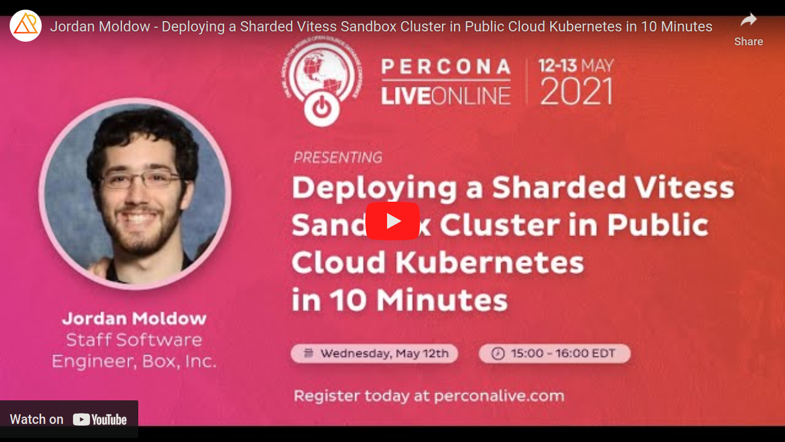
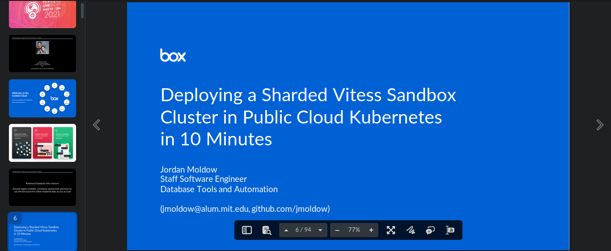

<!--BEGIN:deploying-a-sharded-vitess-sandbox-cluster-->
<!-- AUTO-GENERATED FILE -->

### Deploying a Sharded Vitess Sandbox Cluster in Public Cloud Kubernetes in 10 Minutes

Presented by: **Jordan Moldow**

Presented at: [Percona Live Online - May 2021](#percona-live-online---may-2021)

[[Recording]](https://www.youtube.com/watch?v=Bllc-u_cCGA "Recording")
[[Slides]](https://app.box.com/s/p3e03oqiwv1q3mtclm34mpcb6tqub75j "Slides")

[[Description]](https://web.archive.org/web/20210508001359/https://perconaliveonline.sched.com/event/io6K/deploying-a-sharded-vitess-sandbox-cluster-in-public-cloud-kubernetes-in-10-minutes "Deploying a Sharded Vitess Sandbox Cluster in Public Cloud Kubernetes in 10 Minutes")
[[Vitess operator examples]](https://github.com/jmoldow/vitess-operator-examples "Vitess operator examples")

I show, with a live demo/tutorial, that deploying and evaluating a Vitess ("A database clustering system for horizontal scaling of MySQL" - https://vitess.io) sandbox cluster, into a public cloud environment, can be done super easily.

With the remaining demo time, I demonstrate other Vitess operations, Vitess fundamentals, and Kubernetes fundamentals.

Even with the best possible documentation (and the Vitess documentation is quite good!), getting a fully working cluster, experimenting with it, and getting everything configured the way you want can involve a bunch of trial and error. I hope that my demo can help you bypass some of the more boring trial-and-error, and get running more quickly with your Vitess evaluation.

For this demo, I use the excellent open-source Vitess-operator for Kubernetes, provided by PlanetScale. Even if you aren't considering deploying Vitess on Kubernetes in production, I still highly recommend it for sandbox use. Deploying an arbitrary number of components is super trivial with the operator, and everything auto-wires automatically. No need to delay your evaluation by needing to manually bootstrap a cluster one node at a time, or write your own deployment tools.

 

<!-- AUTO-GENERATED FILE -->
<!--END:deploying-a-sharded-vitess-sandbox-cluster-->
