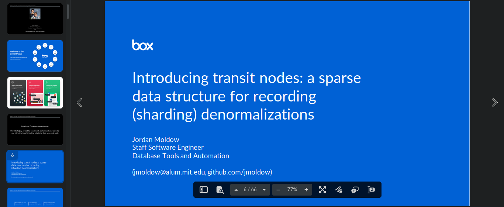

### Introducing Transit Nodes - A Sparse Data Structure for Recording Sharding Denormalizations
<!-- AUTO-GENERATED FILE -->
<!--BEGIN:introducing-transit-nodes-->

### Introducing Transit Nodes - A Sparse Data Structure for Recording Sharding Denormalizations

Presented by: **Jordan Moldow**

Presented at: [Percona Live Online - May 2021](#percona-live-online---may-2021)

[[Recording]](https://www.youtube.com/watch?v=h9HwP3jJYuY "Recording")
[[Slides]](https://app.box.com/s/s5vegq0b7yh6va8op85ftqmt12lqdklt "Slides")

[[Description]](https://web.archive.org/web/20210508001423/https://perconaliveonline.sched.com/event/io8Y/introducing-transit-nodes-a-sparse-data-structure-for-recording-sharding-denormalizations "Introducing Transit Nodes - A Sparse Data Structure for Recording Sharding Denormalizations")
[[Percona Live 2021 Resources]](https://web.archive.org/web/20210605213156/https://www.percona.com/resources/videos/introducing-transit-nodes-sparse-data-structure-recording-denormalizations "Percona Live 2021 Resources")

At Box, we have a fairly uncommon combination of business requirements that, when taken together, means that our relational data access layer must implement cross-shard move operations and orchestration. These moves can be large, and often need to be split across multiple asynchronous transactions. In the middle of this asynchronous orchestration, objects that would ordinarily live on the same shard, may be split across two shards. Our mapping database must faithfully record where each object currently resides, as well as the intended destination.

Viewed more generally, we have a system described by the following:
* A sharded data store;
* With a tree of relationships between object types that can be traversed upwards and downwards;
* With denormalized data that is propagated through the graph (in our case, the target shard id);
* Where the denormalized data is mutable, and might need to be updated in response to a move operation higher up in the tree;
* Where the application needs to control when and how the denormalized data is updated;
* And the application does not need to use the denormalized data in a relational fashion (it doesn't need to be indexed, used in a WHERE clause, etc.)

We recently finished developing and deploying an enhancement to our mapping system, to be able to store the denormalize data in a sparse data structure, with high read performance. When moves are not in progress, no additional data storage is needed besides the graph itself, and reads on the denormalized data are made efficient via caching. When moves are in progress, "transit node" rows are inserted into the mapping database in order to precisely record the new state of objects that have moved already, but while retaining the state of the objects that haven't moved yet. After the moves, the transit node rows can be garbage collected.

The transit node concept was carefully designed with a number of invariants, which make it very safe to cache values without worrying about cache corruption or cache invalidation. We designed the concept for ourselves to store shard IDs, but can theoretically be used for other kinds of denormalizations that match the above generalization.

We will briefly cover the context of sharding at Box, to provide the motivation for the transit node concept. The rest of the talk will present the semantics, invariants, and behaviors of transit nodes, and some results from our deployment. My hope is that the concept can be more broadly useful beyond what we originally designed it for.

 

<!--END:introducing-transit-nodes-->
<!-- AUTO-GENERATED FILE -->
