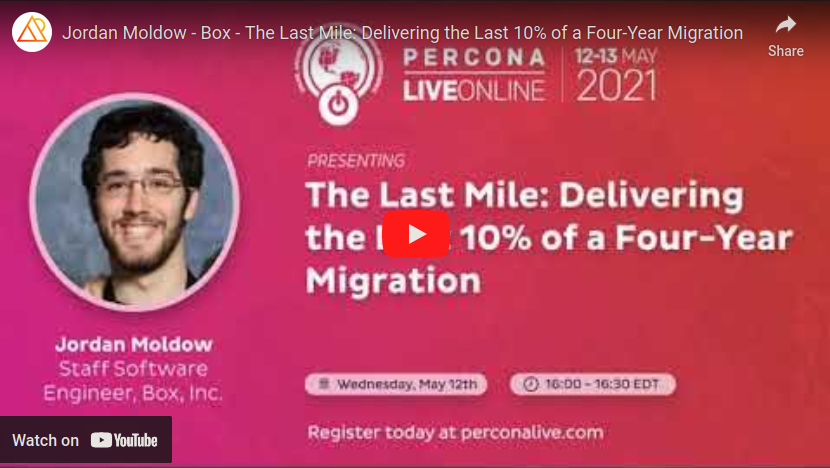
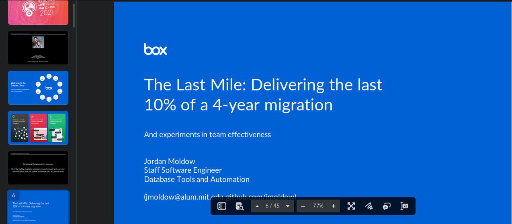

### The Last Mile - Delivering the Last 10 Percent of a 4-year Migration

<!-- AUTO-GENERATED FILE -->
<!--BEGIN:the-last-mile-->

**And experiments in team effectiveness**

Presented by: **Jordan Moldow**

Presented at
- [Percona Live Online - May 2021](#percona-live-online---may-2021)
  * [[Recording]](https://www.youtube.com/watch?v=mYXy5q8rR1Y "Recording")
    [[Slides]](https://app.box.com/s/453j26vrbjbqpffr4spd27prfeq3y2m7 "Slides")
  * [[Description]](https://web.archive.org/web/20210508001407/https://perconaliveonline.sched.com/event/io6f/the-last-mile-delivering-the-last-10-of-a-four-year-migration "The Last Mile - Delivering the Last 10% of a 4-year Migration")
- [DeveloperWeek Global: Enterprise - December 2021](#developerweek-global-enterprise---december-2021)
  * [[Slides]](https://app.box.com/s/nntx8biljij0ts1zoczw31pjzre2sd0e "Slides")
    [[Description]](https://web.archive.org/web/20220810081639/https://embed.emamo.com/event/developerweek-global-enterprise-2021/s/the-last-mile-delivering-the-last-10-of-a-4-year-migration-WK4zqo "The Last Mile: Delivering the Last 10% Of a 4-Year Migration")

In complex projects, the last 10% of the project is often the most difficult part. In this talk, I will share a case study of Box's 4-year effort to get rid of our legacy mapping DB and move the last piece of our legacy monolith MySQL traffic to our data access layer. This talk will cover how to manage technical risk and optimize team execution in a technically complex and operationally distributed environment. This talk will share reflections on useful tactics that led to the successful completion of this four-year migration project for others to learn from and leverage.

As a relatively new Staff engineer, I learned and experimented with building and maintaining a long time-horizon project plan, identifying unknown unknowns, and continually finding ways to de-risk the project at every stage of development.

As the project progressed, I found that successful execution depended not only on these technical strategies, but even more so on how the team operated. In the spirit of Agile and mitigating the isolation of the pandemic, we experimented with almost every aspect of how we worked: how/when we worked together, how our sprints ran, how we evolved designs, and even the minutia of how we retrospected.

In this session, we will have a candid discussion on the technical and organizational strategies that I believe were important to our success, or that were promising enough to warrant more experimentation in the future.

Participants will leave with a few ideas that they should be able to try out within their own teams. Additionally, there are some deeper ideas about team leadership and effectiveness that I hope participants will be able to reflect on going forwards.

 

[View my other conference talks](<.> 'Jordan Moldow’s conference talks — Talks I’ve presented at conferences, meetups, etc.')

<!--END:the-last-mile-->
<!-- AUTO-GENERATED FILE -->
