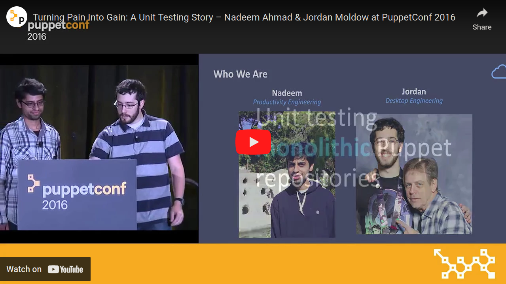

### Turning Pain Into Gain - A Puppet Unit Testing Story
<!-- AUTO-GENERATED FILE -->
<!--BEGIN:turning-pain-into-gain-->

Presented by: Nadeem Ahmad and **Jordan Moldow**

Presented at: [PuppetConf - October 2016](#puppetconf---october-2016)

[[Recording]](https://www.youtube.com/watch?v=5JT2em4YYIo "Recording")
[[Slides]](https://app.box.com/s/vu4cyf0s1eoqg1s9xd1se89tx71zcnoy "Slides")

[[Description]](https://web.archive.org/web/20201021080349/https://puppetconf2016.sched.com/event/6fjL/turning-pain-into-gain-a-unit-testing-story-nadeem-ahmad-jordan-moldow-box "Turning Pain Into Gain: A Puppet Unit Testing Story")
[[Code]](https://github.com/jmoldow/box_spec_helper "Code")

Puppet is integral to Box's infrastructure, serving many purposes. Use of Puppet grew organically, resulting in a large monolith of fragile spaghetti code. When we needed CI, this code was in an untestable state. Out of the box, rspec-puppet didn't work. Rather than continuing to rely only on manual testing or rewriting our code into proper modules, roles, and profiles, we made the unit testing system work with our spaghetti code. Our open-source rspec-puppet extensions enabled us to add coverage for our monolith, and can help others achieve the same. This session covers Box's journey to a fully-featured Puppet CI. We discuss the importance of unit testing, show it's possible to improve testing practices, present solutions to roadblocks we encountered, and share workflows we created.

 

<!--END:turning-pain-into-gain-->
<!-- AUTO-GENERATED FILE -->
